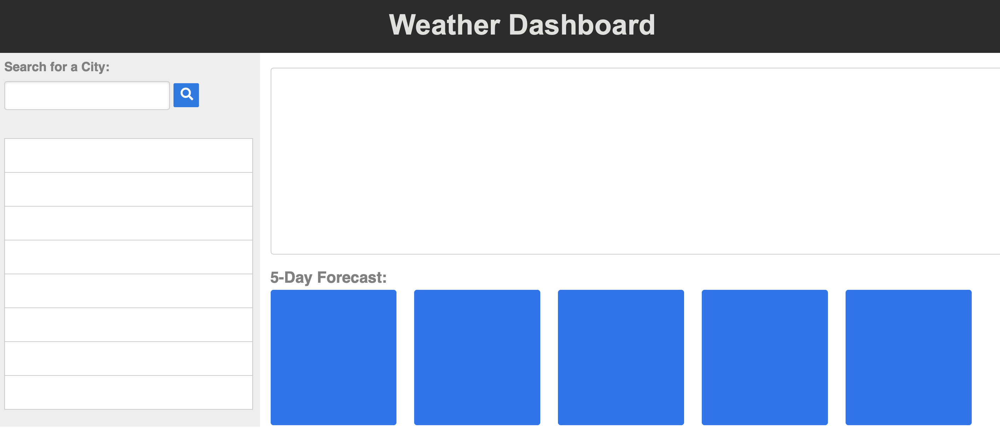
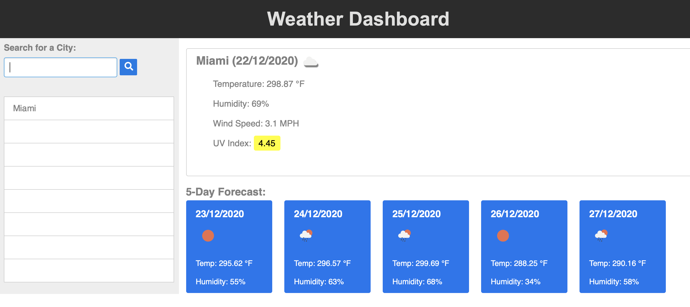
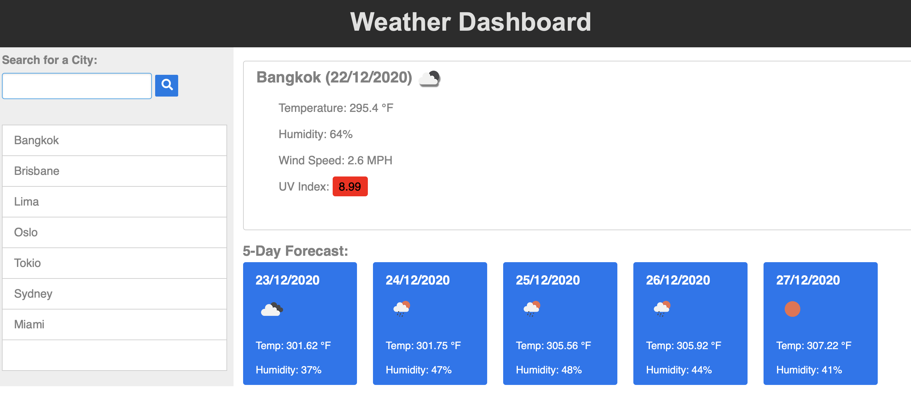
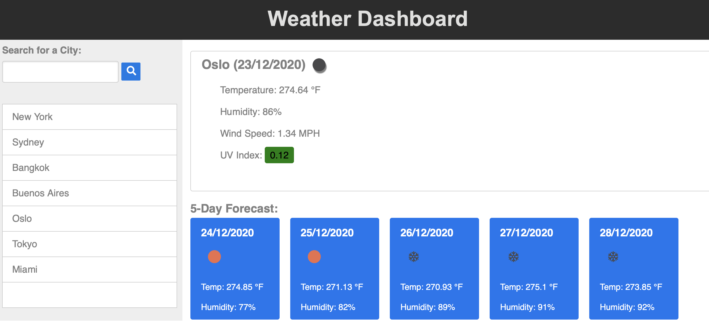

# weatherDashboard
Coding Bootcamp/06-Server-Side-APIs/Homework

## Links:

Github pages link: 'https://avpizarro.github.io/weatherDashboard/'

Github repository link: 'https://github.com/avpizarro/weatherDashboard.git'

## The website helps you view the weather conditions from the cities you choose:

Choose a city to see its weather conditions and add it to your history:

As you add a new city it gets added to your list:

Click on any city on your list to see today's weather
the conditions for the next five days:

